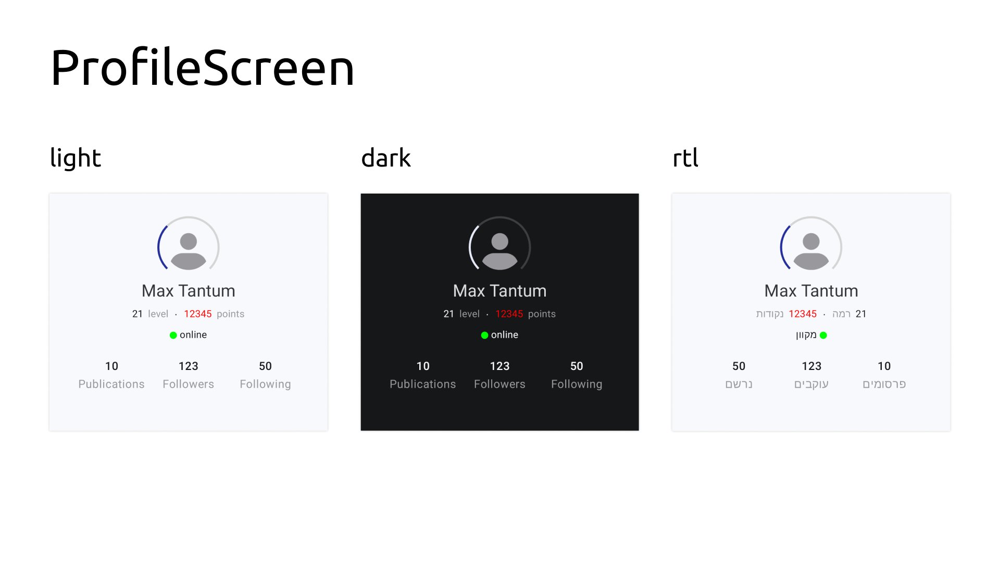

compose-demos
=============

Android JetpackCompose demonstrational screens on various topics

- [ProfileScreen](app/src/main/kotlin/dev/tonycode/demos/jpcompose/ui/screens/profile/ProfileScreen.kt)

## License

[MIT](LICENSE)
